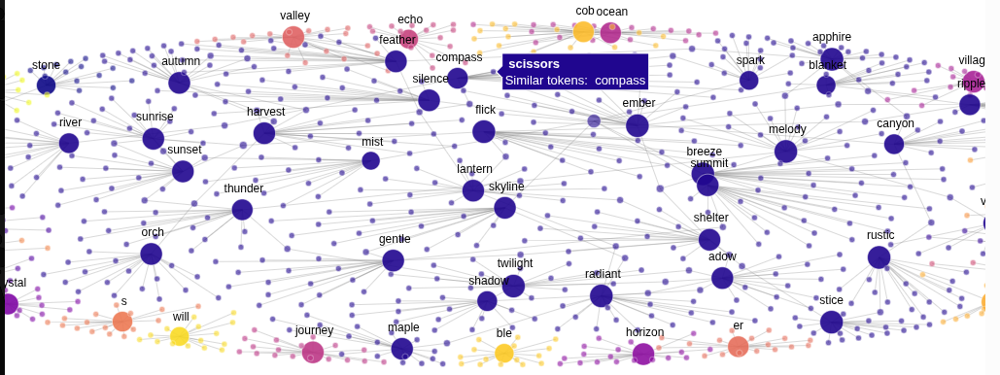

## Day 02 of LLMOPS


### What exactly is an embedding?

Embeddings are the semantic backbone of LLMs, the gate at which raw text is transformed into vectors of numbers that are understandable by the model. When you prompt an LLM to help you debug your code, your words and tokens are transformed into a high-dimensional vector space where semantic relationships become mathematical relationships.




Computers cannot directly reason over:

### "Kubernetes manages containers"

Neural models work with numbers.
An embedding model converts text into a numerical vector:

```text

"Kubernetes manages containers"
              ↓
        Embedding Model
              ↓
[0.124, -0.351, 0.782, 0.091, ...]

Suppose, purely for illustration:

"Kubernetes manages containers"
       [0.82, 0.71, 0.15]

"K8s orchestrates container workloads"
        [0.79, 0.74, 0.18]

```

Their vectors should point in relatively similar directions because the sentences have related meanings.

```text
But:
"I like chocolate cake"

[-0.31, 0.12, 0.91]
```

should be farther away.
That property enables semantic search.

### Token embeddings vs sentence/document embeddings

Yesterday we discussed:

```text
Token
 ↓
Token ID
 ↓
Token Embedding
```

Inside a transformer, individual tokens are represented as vectors.
```text
"Kubernetes manages containers"
              ↓
        Embedding Model
              ↓
    One vector representing
       the entire sentence
```

```text

Later in RAG:

Document
   ↓
Chunk
   ↓
Embedding Model
   ↓
Vector
   ↓
Vector Database
```

For example:
Document 1
```text
"Kubernetes provides container orchestration."

       ↓

[0.21, -0.53, 0.84, ....]
```

The database stores that vector alongside the original text and metadata.

### Embedding dimensions

An embedding isn't normally just three numbers.
A model might produce:

384 dimensions
768 dimensions
1024 dimensions
1536 dimensions
...

```text
For example:
[
  0.023,
 -0.174,
  0.631,
  0.092,
 ...
]
```

If its dimension is 384, every text encoded by that model will have a vector with 384 values.
This becomes operationally important because:

```text
More vectors
       ×
More dimensions
       ×
numeric storage size
       =
More storage / memory
```

Imagine an enterprise RAG system containing 10 million document chunks. Vector storage and search architecture suddenly matter.


## Semantic similarity

Suppose we have:
```text

A = "Kubernetes manages containers"

B = "K8s orchestrates containerized applications"

C = "I bought a new refrigerator"

We expect:
Similarity(A,B) = HIGH

Similarity(A,C) = LOW

```
```text

One common measure is cosine similarity.
Conceptually:
                   B
                  /
                 /
                / small angle
               /
--------------A---------------->

        C
       /
      /
     /
    ↓
```


The closer the direction of two vectors, the higher their cosine similarity.
The formula is:

```text
cos(A,B)= A.B / ||A|| ||B||
```

You don't need to manually calculate this in production, but you should understand what it means.

## Why embeddings matter to an FDE–LLMOps engineer

Imagine a customer says:

We have 2 million HR, procurement and policy documents. Employees should be able to ask questions about them.

You can't simply put 2 million documents into every LLM prompt.

```text
                 OFFLINE / INGESTION

PDF / DOCX / HTML / DB
          ↓
     Extract text
          ↓
        Chunk
          ↓
   Embedding Model
          ↓
       Vectors
          ↓
     Vector Database


                 ONLINE / QUERY

User Question
     ↓
Embedding Model
     ↓
Query Vector
     ↓
Vector Search
     ↓
Relevant Chunks
     ↓
LLM Context
     ↓
LLM
     ↓
Answer
```

You've just seen the basic architecture behind RAG.

Ref : https://huggingface.co/spaces/hesamation/primer-llm-embedding?section=what_are_embeddings?
